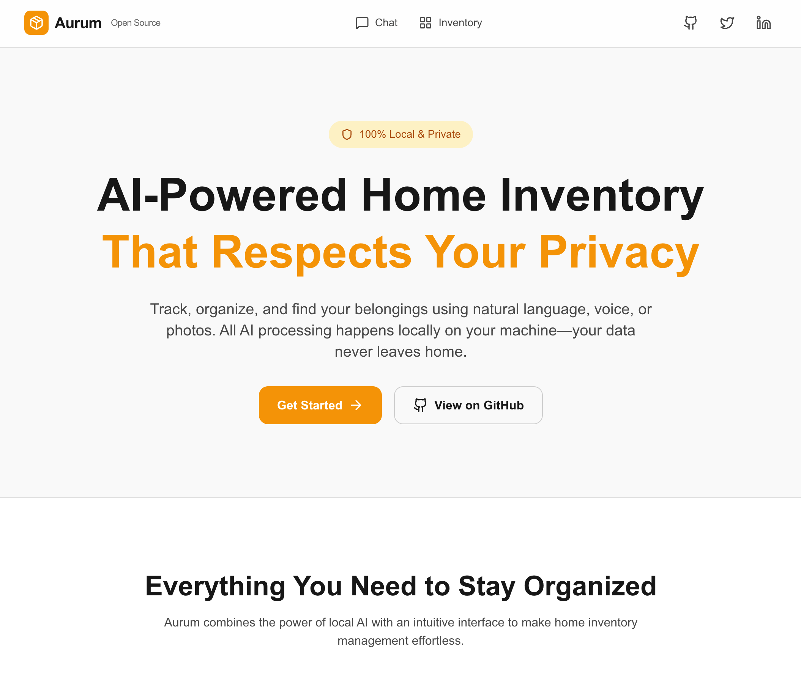

# Aurum Open Source

**AI-Powered Home Inventory Management**

Track, organize, and chat with your home inventory using AI. Built with Next.js, PostgreSQL (pgvector), and Ollama for 100% local AI processing.



## Features

- 🤖 **Natural Language Interface** - Add and search items using conversational AI
- 🔍 **Semantic Search** - Find items even with fuzzy descriptions using vector embeddings
- 📍 **Location-Based Organization** - Group items by where they're stored
- � **Voice Input** - Describe items verbally using faster-whisper transcription
- 📷 **Image Recognition** - Take photos of items and let Qwen VL identify them
- �🏠 **100% Local** - All AI processing runs locally with Ollama (no data leaves your machine)
- 🚀 **Fast & Modern** - Built with Next.js 16, React 19, and TailwindCSS

## Prerequisites

- Node.js 24+
- Docker (for PostgreSQL with pgvector)
- [Ollama](https://ollama.ai) installed locally
- Python 3.10+ (for voice transcription server)

## Quick Start

### 1. Clone and Install

```bash
git clone https://github.com/itsajchan/aurum-open-source.git
cd aurum-open-source
npm install
```

### 2. Start PostgreSQL with pgvector

```bash
docker-compose -f docker-compose-dev.yaml up -d
```

### 3. Pull Required Ollama Models

```bash
# Embedding model for semantic search
ollama pull embeddinggemma:300m

# LLM for natural language understanding
ollama pull llama3.2:3b

# Vision model for image recognition (optional)
ollama pull qwen3-vl
```

### 4. Configure Environment

```bash
cp env.example .env
# Edit .env if needed (defaults work out of the box)
```

### 5. Initialize Database

```bash
npx prisma generate
npx prisma db push
```

### 6. (Optional) Start Voice Transcription Server

For voice input functionality:

```bash
cd faster-whisper
python -m venv venv
source venv/bin/activate  # On Windows: venv\Scripts\activate
pip install -r requirements.txt
python server.py
```

This starts the faster-whisper server on port 9000.

### 7. Run the App

```bash
npm run dev
```

Open [http://localhost:3000](http://localhost:3000) to start using Aurum!

## Usage

### Adding Items
Just describe your items naturally:
- "I have 3 bottles of shampoo in the bathroom cabinet"
- "Add my new headphones to the office desk drawer"

### Finding Items
Ask questions about your inventory:
- "Where did I put the extra toothpaste?"
- "Do I have any batteries?"

### Voice Input
Click "Add Items" on any location, then "Start Recording" to describe items verbally. You can say something like "I have two toilet paper rolls, one comb, 15 razor blade replacements, and 2 boxes of QTips."

### Image Recognition
Click "Take Photo" to capture items and let the AI identify them automatically.

## Tech Stack

- **Framework**: Next.js 16 (App Router)
- **Database**: PostgreSQL with pgvector extension
- **AI/ML**: 
  - Ollama (embeddinggemma:300m for embeddings)
  - Ollama (llama3.2:3b for chat/parsing)
  - Ollama (qwen3-vl for image recognition)
  - faster-whisper (for voice transcription)
- **ORM**: Prisma
- **Styling**: TailwindCSS
- **Icons**: Lucide React

## Author

Built with ❤️ by **Adam Chan**

- Twitter: [@itsajchan](https://twitter.com/itsajchan)
- LinkedIn: [linkedin.com/in/itsajchan](https://linkedin.com/in/itsajchan)
- GitHub: [github.com/itsajchan](https://github.com/itsajchan)

## License

MIT License - feel free to use this for your own projects!
